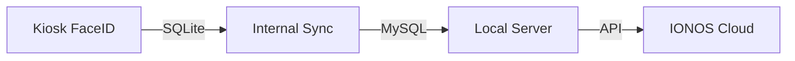

# Hybrid Sync Architecture Guide

This guide explains how the 3-tier database synchronization works in your system.

## 🏗️ System Overview

Your system is a **Hybrid Cloud-Local Architecture** consisting of three layers:

1.  **Face ID Kiosk (Edge)**: Runs on a local machine/tablet. Uses **SQLite** for speed and offline processing.
2.  **Local Server (Central)**: The main admin server on the local network. Uses **MySQL**.
3.  **Cloud Server (Remote)**: The public web application hosted on IONOS. Uses **IONOS MySQL**.

## 🔄 Data How-To

### Layer 1: Kiosk ↔ Local Server (Data Pull/Push)

**Script:** `faceid/sync_manager.py` (Runs automatically in background)

1.  **Staff Info (Downstream)**:
    -   The script pulls `employees` and `schedules` from the **Local MySQL** database every 60 seconds.
    -   It saves them to the **Kiosk SQLite** database so verification works even if the network is down.

2.  **Attendance (Upstream)**:
    -   When a user scans their face, it is saved instantly to **Kiosk SQLite**.
    -   The `sync_manager.py` checks for new records every 5 seconds.
    -   It pushes these new records to the **Local MySQL** database (`attendance_logs`).

### Layer 2: Local Server ↔ IONOS Cloud (Cloud Sync)

**Script:** `auto_sync.py` (Runs automatically in background)

1.  **Sync to Cloud**:
    -   This script monitors your **Local MySQL** database for new changes.
    -   It detects new employees, schedule changes, and attendance logs.
    -   It sends this data securely via HTTPS to the **IONOS API** Endpoint.

2.  **IONOS API**:
    -   **File**: `api/sync_endpoint.php` (Hosted on IONOS)
    -   Receives the data and inserts it into the **IONOS MySQL** database.
    -   This allows staff to view records online immediately.

## 🛠️ How to Sync

### Automatic Method (Recommended)
Just ensure the following scripts are running on your local server:
1.  **Start Kiosk**: `python faceid/start_kiosk.py` (Handles Layer 1 Sync)
2.  **Start Cloud Sync**: `python auto_sync.py` (Handles Layer 2 Sync)

### Manual Setup (If setting up from scratch)
1.  Upload `api/sync_endpoint.php` to your IONOS public folder.
2.  Update `auto_sync.py` with your IONOS website URL and API Key.
3.  Run `auto_sync.py`.

## 🚀 Improvements (Coming Soon)
We are planning to add:
-   **Sync Status Widget**: See directly on your dashboard when the last sync happened.
-   **Settings Page**: Configure your IONOS URL keys directly from the Admin Settings instead of editing code.
